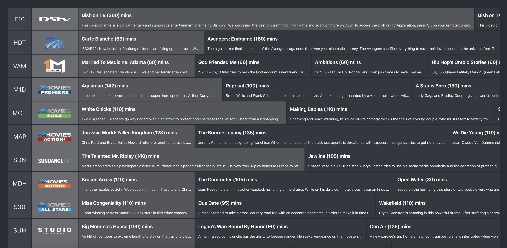

<h1 align="center">Welcome to IPTV Explora 👋</h1>
<p>
  
  <a href="#" target="_blank">
    
  </a>
  <a href="https://twitter.com/md5hashbrown" target="_blank">
    
  </a>
</p>

> TV Guide + Player for IPTV streams (m3u/8 + EPG)

### 🏠 [Homepage](https://iptv-explora.netlify.com)



### ✨ [Demo](https://iptv-explora.netlify.com)

## Install

```sh
yarn
```

## Usage

```sh
yarn start
```

## Run tests

```sh
yarn test
```

## Author

👤 **Nusrath Khan**

- Website: https://nusrath.com
- Twitter: [@md5hashbrown](https://twitter.com/md5hashbrown)
- Github: [@nunsie](https://github.com/nunsie)

## 🤝 Contributing

Contributions, issues and feature requests are welcome!<br />Feel free to check [issues page](https://github.com/nunsie/iptv-explora/issues/new).

## Show your support

Give a ⭐️ if this project helped you!

---

_This README was generated with ❤️ by [readme-md-generator](https://github.com/kefranabg/readme-md-generator)_
